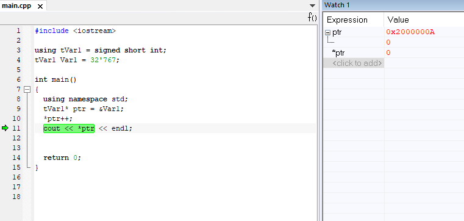
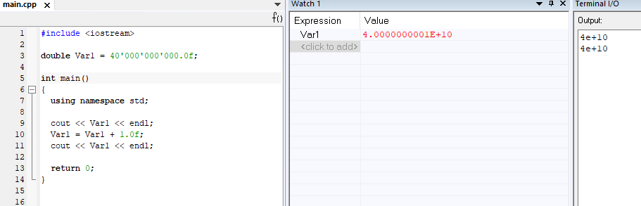

=== Изучение переменных

*Задание*: создать глобальную переменную типа
_unsigned short_ и присвоить ей значение _65535_. прибавить
к данной переменной 1 - описать что получилось и почему.

.Полученный код

При добавлении единицы к переменной _Var1_,
у нас получился ноль.

.Результат

_Вывод_: Произошла потеря бит из-за того, что переменной не было
выделено достаточно памяти для хранения и произошло переполнение
переменной. В нашем случае переменная типа unsigned short может
занимать 2 байта, а число 65536 уже занимает 3 байта.

*Задание*: поменять тип
переменной на *signed short* и присвоить ей значение _32767_.
Полученный код выглядит следующим образом.

.Полученный код

При добавлении единицы получилось число
_-32 768_, а было 32767.

_Вывод_:Произошло переполнение
переменной, в которой старший бит зарезервирован под знак числа.
После того как он заполнился, число превратилось в
максимально возможное отрицательное.

*Задание*: Не меняя
тип переменной взять адрес переменной
(оператор &) - вывести адрес переменной в терминал.

.Вывод адреса переменной в терминал

Как можем заметить, в терминал вывелся адрес, по которому записана переменная
Var1. Он равен  _0x20000008_.

*Задание*: не меняя переменной выполнить явное преобразование адреса
переменной к типу _указатель_ на _short_ используя
_reinterpret_cast_ и присвоить локальной переменной типа _short_.

.Код программы
image::photos/Code.png[]

.Результат
image::photos/Code1.png[]

Вывод: адрес переменной и указатель,
который хранит адрес этой переменной равны между
собой, так как signed short и short являются одинаковыми типами классов.

*Задание*: Разыменовать указатель и
вывести в терминал значение лежащее по адресу, указанному в указателе.

.Результат выполнения

Вывод: *ptr изменилось с 32767 на 0, так как указатель стал
указывать на другую область памяти.

Значение ptr изменилось с 0x20000008 на 0x2000000A. Это произшло потому что short - 2-байтовый тип
переменной и мы прибавили к восьмерке 2 и получилось 10.

*Задание*: заменить тип переменной с _unsigned short_ на _short_ и присвоить
ей значение _65 535_.

.Полученный результат

Мы получили, что при изменении типа переменной
на short со значением 65 535 в терминале получаем
-1. Это получается потому что наибольшее число,
которое можно без переполнения положить - это 32 767.
А число 65 535 = (32 767 + 1) + 32 767= -32 768 + 32 767 = -1

*Задание*: сделать явное преобразование типа к _short_ и объяснить
полученный результат.

.Результат

Как можно заметить, после явного преобразования мы получили такое же значение _-1_.
Это произошло из-за того, что мы производим явное преобразование к такому же
типу данных, которым он был до преобразования.

*Задание*: создание переменной типа
float и присвоение ей значения _40'000'000'000F_. А также, прибавление единицы
к этому значению и вывод в окно _Watch_.

.Результат
image::photos/LastOne.png[]

Как можем заметить, результаты в окнах _Watch_ и _Terminal_ не отличаются, так как у
типа _float_ не хватает точности, чтобы отобразить прибавленную нами единицу.

Теперь заменим тип _float_ на _double_ и произведём аналогичные действия:

.Полученный результат

Отметим, что при смене типа данных переменной с _float_ на _double_
в окнах _Watch_ и _Terminal_
значения стали разными, так как у _double_
точность в два раза выше чем у _float_, единица отобразилась.

